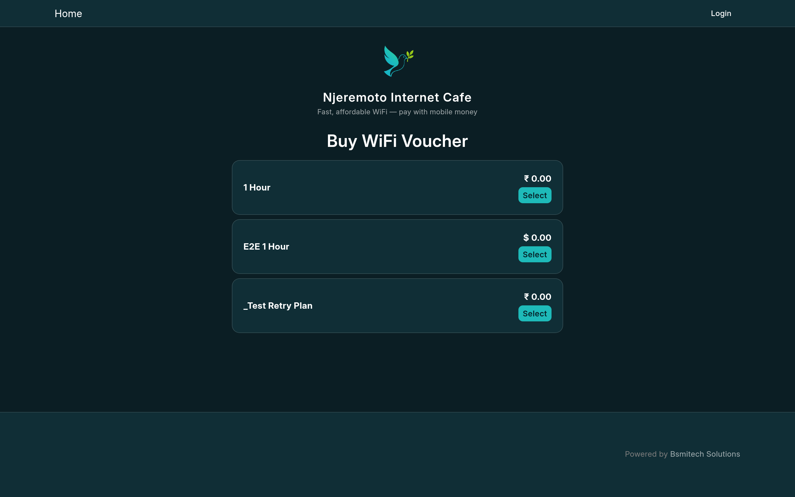
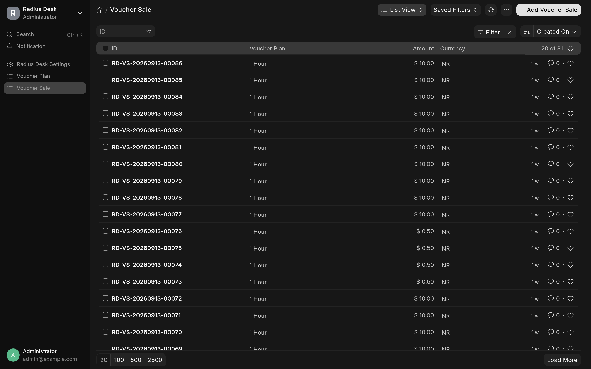
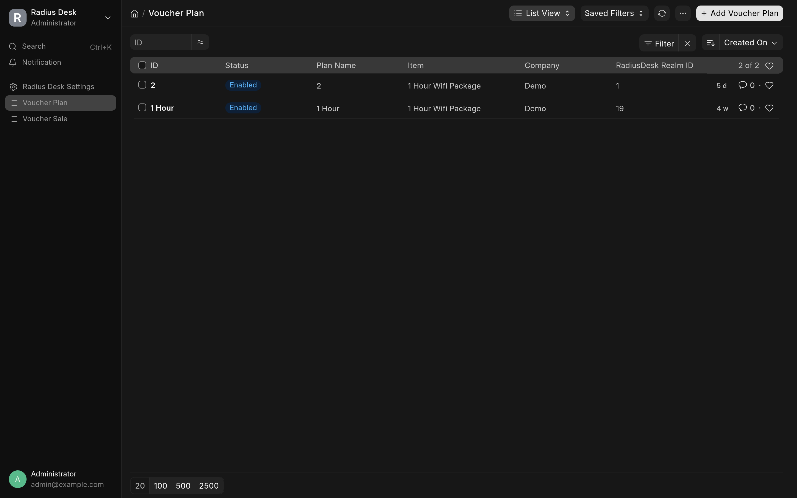

# Radius Desk

A Frappe app that integrates with RadiusDesk (cake4) API to automate voucher generation, payment processing, and captive-portal hotspot login for ISP/cafe deployments. Supports POS and web voucher sales with PesaPay and direct cash payment modes.

---

## Value Proposition

- **Auto-create vouchers** on POS/Sales Invoice submit — no manual "Buy Voucher" button needed.
- **Two fulfillment paths**: PesaPay seamless payments (EcoCash/InnBucks/Omari) and direct cash/other-payment confirmation at the till.
- **Hotspot captive-portal integration** — validated router login URLs prevent open redirects and LAN injection.
- **Guest checkout** — public web page that initiates payments, polls status, and delivers voucher codes via URL fragment.
- **Fulfillment retry scheduler** — re-runs stale "Fulfillment Failed" sales and emails operators.
- **POS receipt voucher summary** — displays auto-generated voucher codes on completed orders.

---

## Features (from observed code)

| Feature | Implementation |
|---|---|
| Auto-voucher on invoice submit | `doc_events` in `hooks.py` triggers `create_vouchers_for_invoice` for POS Invoice and Sales Invoice |
| Background job processing | `frappe.enqueue` in `voucher_automation.py` runs fulfillment as system user, preserving the cashier's web session |
| PesaPay seamless payments | `initiate_voucher_payment` / `confirm_voucher_payment` / `confirm_voucher_web_checkout` whitelisted methods |
| Non-PesaPay cash fulfillment | `confirm_voucher_sale` method for cash/other payments collected at till |
| Voucher price resolution | `get_voucher_price` reads from the configured selling price list, falls back to plan price |
| Hotspot URL validation | `validate_hotspot_url` in `hotspot_embed.py` enforces private-IP allowlist + exact-pin matching |
| Rate limiting | `ensure_rate_limit` in `hotspot_embed.py` caps per-phone and per-IP checkout attempts |
| System user & permissions | `ensure_system_user` creates app-owned role/user with minimal `Custom DocPerm` records |
| Fulfillment retry & idempotency | `retry_fulfillment_failed_sales` scheduler; `find_voucher_by_extra_value` duplicate guard; `fulfill_voucher_sale` resume logic |
| POS receipt voucher summary | `pos_voucher_summary.js` polls `get_voucher_codes_for_invoice` and shows codes/spinner |

> Method names above are shorthand. Full paths: `radius_desk.radius_desk.doctype.voucher_sale.voucher_sale.<method>` for the voucher-sale methods (there is no `radius_desk/api.py`); helpers live in `radius_desk/utils/` (`voucher_automation.py`, `hotspot_embed.py`, `system_user.py`, `fulfillment_retry.py`).

---

### Screenshots

Self-service guest checkout (`/voucher-checkout/`):



Voucher Sales and Voucher Plans (desk):





## Installation

### Via Bench CLI

```bash
cd $PATH_TO_YOUR_BENCH
bench get-app https://github.com/stelele/frappe-radiusdesk --branch version-16
bench --site <site-name> install-app radius_desk
```

> Note: the repo is `frappe-radiusdesk` (hyphen) but checks out as bench folder `radius_desk` (underscore).

### Frappe Cloud

1. In your Frappe Cloud dashboard, add the app from GitHub: `stelele/frappe-radiusdesk`, branch `version-16`.
2. Install the app (`radius_desk`) on your site.
3. After installation, configure **Radius Desk Settings** (see Configuration reference below).

---

## Setup

### RADIUSdesk Connection Settings

After installation, configure **Radius Desk Settings** (DocType: `Radius Desk Settings`, singleton).

Required fields:

| Field | Type | Description |
|---|---|---|
| **Server URL** | Data, Required | Base URL of the RadiusDesk instance, e.g. `https://radius.example.com`. The app normalizes this to `{server}/cake4/rd_cake`. |
| **Username** | Data, Required | RadiusDesk admin username |
| **Password** | Password, Required | RadiusDesk admin password (encrypted at rest) |
| **Cloud ID** | Data, Required | Your RadiusDesk cloud identifier |
| **Default Company** | Link → Company, Required | Company that owns the voucher plans |
| **Default Walk-in Customer** | Link → Customer, Required | Default customer for auto-created invoices |
| **Pesepay Gateway** | Link → Payment Gateway, Required | The PesaPay gateway name (e.g. `Pesepay-Test Gateway`) |

Optional fields:

| Field | Type | Description |
|---|---|---|
| **Selling Price List** | Link → Price List | Price list that holds voucher item prices (single source of truth; not validated as required) |
| **Hotspot Login URL** | Data | Exact router login URL (e.g. `http://192.168.88.1/login`). When set, it is pinned as the accepted router URL — but the portal return prefix below (pinned value or the app's `https://radius.giftmugweni.com/login/` fallback) is also accepted for the voucher-fragment return leg, since `validate_hotspot_url` matches the prefix before the pinned URL. |
| **Hotspot Portal Return Prefix** | Data | Pinned https prefix the guest checkout may return the voucher fragment to (e.g. `https://radius.giftmugweni.com/login/`). When empty, the app falls back to `https://radius.giftmugweni.com/login/`. See hotspot portal return flow. |

### System User

The app creates a system user `radius-desk-system@example.com` with role `Radius Desk System` and minimal permissions (Account.read, POS Invoice.create/submit/write/read, Sales Invoice.create/submit/write/read, Voucher Sale.create/write/read, Voucher Plan.read, Radius Desk Settings.read, Item.read, Warehouse.read). This user is used for privileged background work (creating/submitting POS Invoices) and never logs in interactively.

---

## Usage Walkthrough

### Voucher Generation / Purchase Flow

#### 1. POS Flow (cashier-assisted)

1. Create a **POS Invoice** with a **Voucher Plan** item (e.g. "WiFi Voucher").
2. On invoice submit, the app auto-creates a **Voucher Sale** in `Draft` status (background job).
3. The cashier selects a payment method:
   - **PesaPay** (EcoCash/InnBucks/Omari): `initiate_voucher_payment` → customer approves on phone → gateway reports SUCCESS → `confirm_voucher_payment` → fulfillment creates the RadiusDesk voucher → invoice is submitted and stamped with the voucher code.
   - **Cash/Other**: `confirm_voucher_sale` with `payment_method="Cash"` → immediate voucher creation → invoice stamped.
4. The POS receipt screen shows the voucher code (via `pos_voucher_summary.js` polling).

#### 2. Web / Guest Flow (self-service)

1. Public page: `/voucher-checkout/` — customer selects a plan, enters phone number, chooses payment method.
2. `create_web_checkout` creates a `Voucher Sale` in `Draft` status, initiates PesaPay payment, and returns a `checkout_token`.
3. The page polls `confirm_voucher_web_checkout` with the `poll_url` every 3s; on gateway SUCCESS it confirms and fulfills immediately.
4. The PesaPay webhook (`on_payment_authorized`) and scheduler are fallback only.
5. The voucher code appears in the result panel and is delivered to the hotspot login page via URL fragment (`#rd-voucher=<code>`).

#### 3. Admin / Retry Flow

- **Stale "Fulfillment Failed" sales**: The every-5-minute cron scheduler (`0/5 * * * *` in `hooks.py`) runs `retry_fulfillment_failed_sales` for sales that have been failed for >15 minutes. On success, the voucher code is adopted (if already created on RadiusDesk) or a new voucher is created.
- **Manual retry**: `retry_voucher_sale` resumes a `Fulfillment Failed` or `Voucher Created` sale.
- **Reset declined payment**: `reset_voucher_sale` returns a `Payment Pending` sale to `Draft` for another gateway attempt.

---

## Configuration Reference

### Radius Desk Settings (singleton)

All configuration lives in the **Radius Desk Settings** Doctype. See the Doctype JSON for the complete field list.

### POS Settings

The app honors `POS Settings.invoice_type` (`POS Invoice` or `Sales Invoice`). The invoice type is determined by `get_invoice_type()` in `pos_infra.py`, which reads from the site's POS Settings. Note the app does force the value: `after_migrate` runs `installer._ensure_pos_invoice_mode()` (installer.py), which sets `POS Settings.invoice_type` to `POS Invoice` on every migration — required because ERPNext disables the POS Invoice doctype in Sales Invoice mode. An admin change back to `Sales Invoice` is honored by `get_invoice_type()` until the next `after_migrate` re-applies the forcing.

### Voucher Plans

Create **Voucher Plan** records (DocType: `Voucher Plan`) with:

| Field | Type | Required | Description |
|---|---|---|---|
| **plan_name** | Data | Yes | Unique plan name |
| **item** | Link → Item | Yes | The item sold (e.g. "WiFi Voucher") |
| **company** | Link → Company | Yes | Company owning the plan |
| **radius_realm_id** | Data | Yes | RadiusDesk realm ID |
| **radius_profile_id** | Data | Yes | RadiusDesk profile ID |
| **price** | Currency, Read-only | Yes* | Synced from the item's selling price list (falls back to plan price) |
| **currency** | Link → Currency | Yes | Must match company's default currency |
| **never_expire** | Check | No | If enabled, voucher never expires |
| **sort_order** | Int | No | Grid ordering |

### Payment Gateways

Configure a PesaPay gateway in ERPNext with:
- Gateway name (e.g. "Test Gateway")
- Integration key and encryption key
- Use sandbox mode for testing

Then create a Payment Gateway record linking to the PesaPay Settings, and a Mode of Payment record for each method (EcoCash, InnBucks, Omari).

---

## Troubleshooting / FAQ

| Symptom | Likely Cause | Fix |
|---|---|---|
| Voucher Sale stays in `Draft` forever | PesaPay initiation failed (unsupported method/currency) | Check `_validate_pesepay_combo`; EcoCash only works in USD/ZiG |
| "Payment could not be initiated" | Missing Radius Desk Settings (server_url, username, password, cloud_id, default_company, default_walkin_customer, pesepay_gateway) | Complete all seven required fields in Radius Desk Settings |
| Voucher code never appears on POS receipt | Fulfillment job stuck or RadiusDesk API error | Check server logs for `RadiusDeskException`; verify RadiusDesk credentials |
| Invoice submits but no voucher sale/code is created | Voucher Plan item has no Item Price in the selling price list (item is silently skipped, log-only) | Set an Item Price in the configured selling price list; check server logs for `RadiusDesk auto voucher` errors |
| Hotspot login URL rejected | URL has userinfo, non-private IP, or disallowed characters | `Hotspot Login URL` must be the exact router **IP** URL (hostnames are rejected); use `validate_hotspot_url` — only private/loopback/link-local IPs allowed. Configure a pinned HTTPS production domain via `Hotspot Portal Return Prefix` instead |
| "PesaPay does not support EcoCash payments in INR" | Unsupported method/currency combo | EcoCash settles only in USD or ZiG; switch plan currency or use a supported method |
| Daily POS opening entry fails | Missing pesepay_gateway or default_company in Settings | Configure both in Radius Desk Settings |
| Integration Request stays in `Queued` | Scheduler not running or webhook not fired | Ensure the cron scheduler runs `retry_fulfillment_failed_sales` every 5 min; verify PesaPay webhook reaches the site |

---

## Contributing

1. Fork the repo and install pre-commit hooks:

```bash
cd apps/radius_desk
pre-commit install
```

2. Run the test suite:

```bash
bench --site <site> run-tests --app radius_desk
```

3. Follow the existing code style (ruff + eslint + prettier). See `.editorconfig`, `.eslintrc`, and `pyproject.toml` for config.
4. Add tests under `radius_desk/tests/` for any new functionality.
5. Submit a PR — all PRs require code review and passing tests.

---

## License

MIT

Copyright (c) 2026 Gift Mugweni

Permission is hereby granted, free of charge, to any person obtaining a copy
of this software and associated documentation files (the "Software"), to deal
in the Software without restriction, including without limitation the rights
to use, copy, modify, merge, publish, distribute, sublicense, and/or sell
copies of the Software, and to permit persons to whom the Software is
furnished to do so, subject to the following conditions:

The above copyright notice and this permission notice shall be included in all
copies or substantial portions of the Software.

THE SOFTWARE IS PROVIDED "AS IS", WITHOUT WARRANTY OF ANY KIND, EXPRESS OR
IMPLIED, INCLUDING BUT NOT LIMITED TO THE WARRANTIES OF MERCHANTABILITY,
FITNESS FOR A PARTICULAR PURPOSE AND NONINFRINGEMENT. IN NO EVENT SHALL THE
AUTHORS OR COPYRIGHT HOLDERS BE LIABLE FOR ANY CLAIM, DAMAGES OR OTHER
LIABILITY, WHETHER IN AN ACTION OF CONTRACT, TORT OR OTHERWISE, ARISING FROM,
OUT OF OR IN CONNECTION WITH THE SOFTWARE OR THE USE OR OTHER DEALINGS IN THE
SOFTWARE.